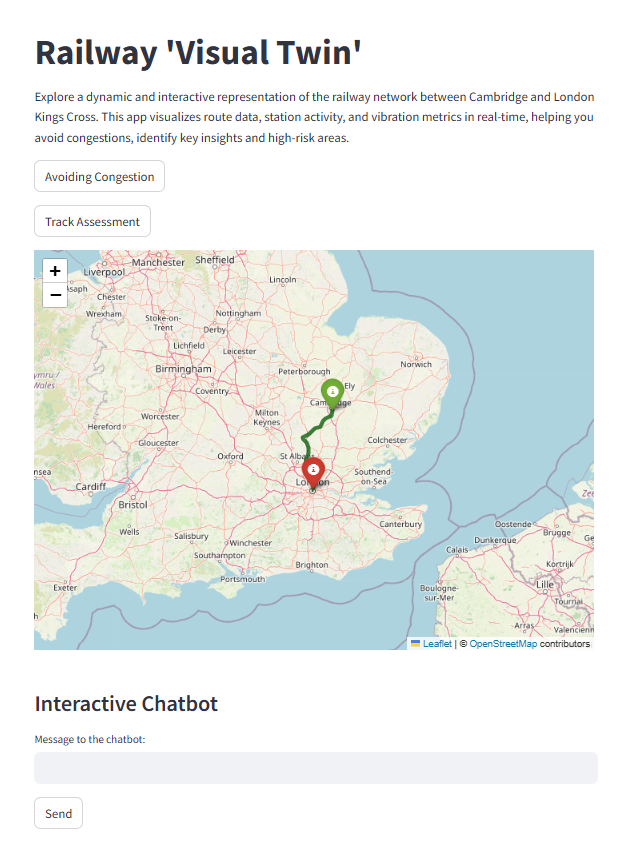

# Visual Twin Proposal

This repository hosts the Visual Twin Proposal project, a data-driven railway monitoring platform. It integrates a Streamlit app, chatbot interaction, and object detection for enhanced railway condition monitoring.



## Project Structure
```plaintext
VisualTwin/
│
├── main_app.py                    # The main application file
├── module_chatbot.py              # The chatbot module
├── Dockerfile                     # Dockerfile for containerizing the app
├── requirements.txt               # Python dependencies for the app
├── README.md                      # Project description and instructions
├── data/                          # Folder for datasets or statics
│   ├── route_info_vibrations.csv  # Route info between London Kings Cross and Cambridge for demo
│   └── videos.mp4                 # Demo videos
│   └── images.png                 # Demo sensor data
    └── data.ods                   # Example dataset from ORR (Train Station Usuage)
├── notebooks/                     # Jupyter notebooks for instructions or experiments
│   └── object_detection.ipynb     # Instruction notebook for object detection module

## Features
- **Visual Railway Monitoring**: Interactive visualization of UK railway usage and routes.
- **Chatbot Interaction**: Integrated chatbot for inquiries.
- **Object Detection Module**: Detects specific conditions in railway assets.

## Installation
1. Clone this repository:
   ```bash
   git clone https://github.com/yjq349825834/VisualTwin.git
   cd VisualTwin

2. Install dependencies:
   ```bash
   pip install -r requirements.txt

3. Run the Streamlit app:
   ```bash
   streamlit run app/visual_twin_app.py
